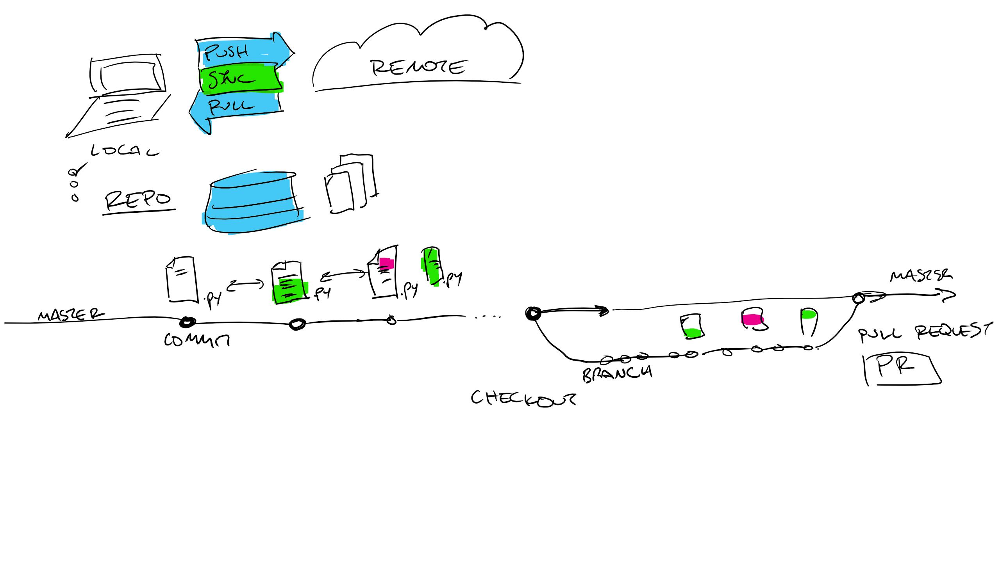

# Terminology

- **version control**
    + [git](https://git-scm.com/book/en/v2/Getting-Started-Git-Basics)
        * what is it
        * what does it enable?
- **repository**
    + This is the place your code is stored.
- **fork** or **forking**
    + This is the process of creating your own copy of another project.
    + Forks are a bridge that connects projects together for multiple purposes:
        * You may want to use a project as a basis for your new project.
        * You may want to add new features or fix bug on another project without fear of interfering with the original code.
    + Read this [4 minute article about forking](https://guides.github.com/activities/forking/).
- **branch**
    + A branch is a smart copy of a codebase that knows about it's history. You typically create a branch of your own to do work on. This is your workspace that is compelete safe to experiment with.
- **master branch**
    + This is typically used as the production code and usually has protections on it to prevent contributors from directly interfering with it.
- **commit**
    + This is a save point.
- **diff**
    + This is a way to see the differences between different points in time.
- **local vs remote**
    + Work is done in your local computer. The remote is the server where everyone's work (including yours) is backed up to.
- **pushing to remote**
    + Pushing commits is the act of syncing your local commits and backing them up to the remote server. This allows others to see your work.
- **pulling**
    + This syncs changes from the server to your local repository.
- **pull request**
    + Once you have done work, committed it and pushed it, you'll create a *pull request*. This is a signal and way to communicate to the maintainer that you've done work and it's ready for review.
- **code review**
    + Collaborators like to check each other's work to ensure quality. This is a way for experienced engineers to mentor, and a way to share knowledge.
- **merge**
    + Once a code review has taken place and it is determined that the work should be integrated into the production codebase, a merge is done.
- **fork**
    + Forking is the act of copying the repo to your own account.
